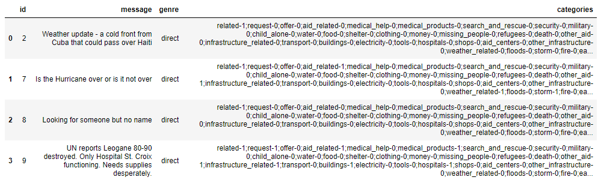
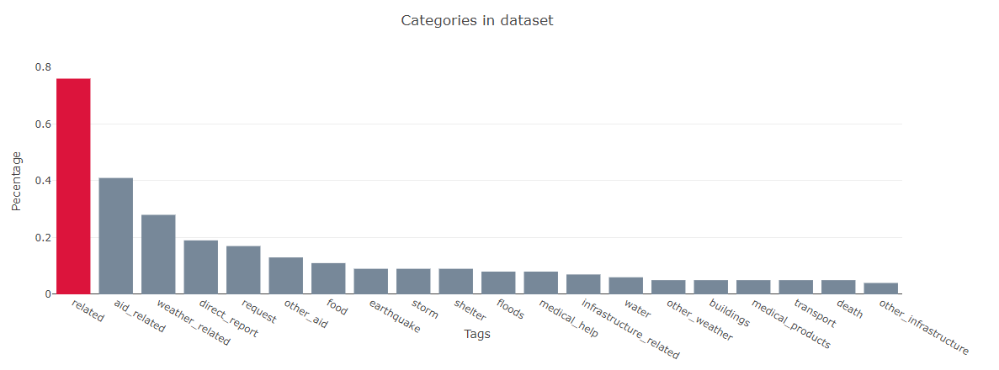
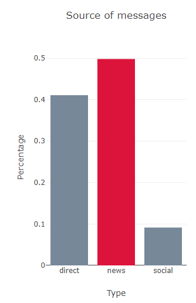

# NLP - ML pipeline Disaster response
During a catastrophe, thousands of messages flood the networks. Disaster response organizations are overwhelmed to filter out the most important messages.
That's why an automated system that tags messages so they can be directed to different organizations can be essential.
## Table of contents
1. [Project](#project)
2. [Dataset](#dataset)
3. [Files](#files)
4. [ETL Pipeline](#elt)
5. [ML Pipeline](#ml)
6. [Flask Web App](#webapp)
7. [Instructions](#instructions)

## Project 
The Goal of this project is to build a ML pipeline to classify disaster messages into several categories such as *food*, *medical_help*, *fire*...
The classifier is implemented in a web app.

## Dataset 
The data set was povided by [Appen](https://www.figure-eight.com/), has a *message* and a *categories* files. This is how the dataset looks like after merging the two files:
  
  

## Files 
- [app]  
    | - [templates]  
    | | - go.html # classification result page of web app  
    | | - master.html # main page of web app  
    | - run.py # Flask file that runs app  
- [data]   
    | - disaster_categories.csv  # data to process  
    | - disaster_messages.csv  # data to process  
    | - process_data.py # script that creates the database with the cleaned data  
    | - DisasterResponse.db # Database with the cleaned data (its generated by the pipeline)  
- [models]  
    | - train_classifier.py # script that: loads database, creates model, train model, save model  
    | - classifier.pkl # saved model (its generated by the pipeline)  
- [images] # Images for the readme file  
    | - categories.png  
    | - dataset.png  
    | - source.png  

| - ETL_Pipeline_Preparation.ipynb # Exploratorie notebook  
| - ML_pipeline.ipynb # Exploratorie notebook  
| - readme.md  

This project includes two Juyter Notebook files, ETL y ML. In each of them, an initial exploration of the ETL and ML process is made, respectively.  
The Python file for the ETL process is `data/process_data.py`  
The Python file for the ML process is `models/train_classifier.py`  
The Python for running the Flask web app is `app/run.py`  
En la carpera `data` se incluyen los data sets y el archivo process_data.py donde ....
En la carpeta `models` se incluye el archivo train_classifier.py
En la carpeta `app` 

### ETL Pipeline 
The following steps are performed:
- Load *messages* and *categories* datasets
- Merge both datasets
- Clean data
- Stores the data in a SQLite database

### ML Pipeline 
The following steps are performed:  
- Loads the data from the database  
- Splits in training and test sets 
- Builds a NLP pipeline
- Train the best model as discussed in the ML notebook
- Export the final model `.pkl`

### Flask Web App 
The web application displays visualizations of the data set, and classifies the messages entered by the user.

## Instructions 
Run the following commands in the project's root directory folder.
1. To run ETL pipeline and create the database:  
`python data/process_data.py data/disaster_messages.csv`
2. To run ML pipeline that trains classifier and saves `.pkl` model:  
`python models/train_classifier.py data/DisasterResponse.db models/classifier.pkl.pkl`  
3. To run the web app run the following command in the apps's directory:  
`python run.py`  
4. Go to http://127.0.0.1:3001

